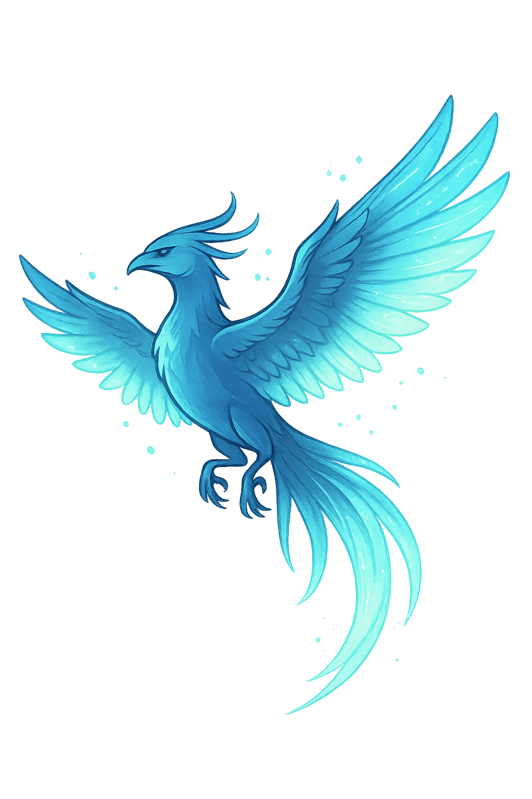

# Skydancer: A Spatial Web Sample

<p align="center">
  
</p>

This project showcases the **[Spatial Web features announced at WWDC25](https://developer.apple.com/videos/play/wwdc2025/237/)**, including support for `<model>` and `<link rel="spatial-backdrop">` in Safari on visionOS. It demonstrates how to present interactive 3D content directly on the web using USDZ files—no additional frameworks or plugins required.

Skydancer is a fictional mythical bird rendered in 3D, designed as a creative example of spatial web presentation.

## ✨ Features
- Uses the new `<model>` element introduced in WWDC25
- Supports `<link rel="spatial-backdrop">` for immersive backgrounds
- Loading indicator while the model is being prepared
- Fallback image for non-compatible browsers
- Simple, self-contained HTML and CSS
- Fully local preview support without server dependencies

## 🔧 How to Run Locally
To preview this site on your local machine:

```sh
python3 server.py
```

Then open http://localhost:8000 in Safari on visionOS 26.

## 💻 Requirements
- Safari on visionOS 26
- Python 3.x (for local server)

## ⚠️ USDZ & Licensing Notes
- USDZ files must be served with the correct MIME type:
Content-Type: model/vnd.usdz+zip
This is automatically handled by Python’s built-in HTTP server, or can be configured explicitly in S3 + CloudFront.
- All 3D assets used in this project are under Creative Commons Attribution 4.0:
    - [phoenix bird](https://skfb.ly/6vLBp) by NORBERTO-3D
    - [FREE - SkyBox Anime Sky](https://skfb.ly/oIINu) by Paul
    - Proper attribution is required if you use these assets elsewhere.

## 🪪 License
This project is licensed under the [MIT License](LICENSE).
You are free to use, modify, and distribute it with attribution.
